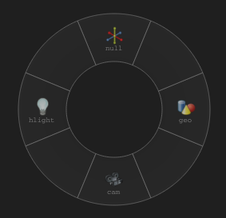
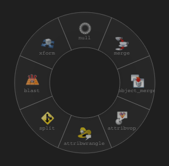
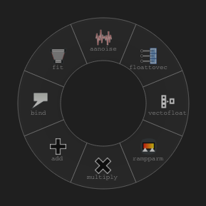

<div align="center">
  <h1>Radial Menu</h1>
  <h3>A contextual radial menu for selecting nodes in the Houdini node graph</h3>
  
  
  
</div>

# Usage
The default hotkey is ***Shift+Tab*** while hovering over the node graph.  
If this doesn't work, check the Python shell for errors.

# Installation
To install, download the **nodegraphhooks.py** file and put it in the <ins>**pythonX.Xlibs**</ins> directory in your Houdini home directory.  

Replace the <ins>**X.X**</ins> with Houdini's Python version. Currently Houdini uses Python 3.11 but this will likely change in the future when the [VFX reference platform](https://vfxplatform.com/) updates.
> I recommend placing it at **$HOUDINI_USER_PREF_DIR/python3.11libs** and not **$HFS/houdini/python3.11libs**.  


#### On linux this can be found at:  
```
/home/[USERNAME]/houdini[HOUDINI_VERSION]/python[PYTHON_VERSION]libs
```  
#### eg.  
```
/home/john/houdini20.5/python3.11libs
```
> [!Important]
> The **pythonX.Xlibs** dir may need to be created if it doesn't already exist.
- If you already have a **nodegraphhooks.py** file it's contents will need to be manually merged with this one.  
- See [here](https://www.sidefx.com/docs/houdini/hom/locations.html#disk) for more info about this directory.

# Customization
The nodes available in the menu for each context and the menu hotkey can be customized in the createEventHandler function at the top of the script.
```python
if contextLabel == 'Geometry':
    otlsList = ['null', 'xform', 'blast', 'split', 'attribwrangle', 'attribvop', 'object_merge', 'merge']

elif contextLabel == 'Objects':
    otlsList = ['null', '', 'hlight', '', 'cam', '', 'geo', '']

elif contextLabel == 'Outputs':
    otlsList = ['null', '', '', '', '', 'fetch', 'ifd', 'merge']

elif contextLabel == 'VEX Builder':
    otlsList = ['aanoise', 'fit', 'bind', 'add', 'multiply', 'rampparm', 'vectofloat', 'floattovec']

else:
    return None, False
```
